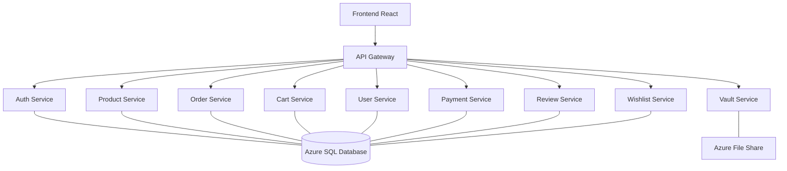

# 🛒 StreamShop: Netflix-Style Microservices E-Commerce Platform


**StreamShop** is a high-performance, modern e-commerce ecosystem built with a Netflix-inspired cinematic UI. It leverages a robust microservices architecture, containerized with Docker, and orchestrated on Kubernetes (Azure AKS).

---

## ✨ Features

- **🎬 Cinematic UI/UX**: Premium Netflix-style homepage with auto-playing video trailers on hover.
- **🏗️ Microservices Architecture**: 9 independent services communicating via a centralized API Gateway.
- **🔐 Seamless Auth**: Global authentication using OAuth2 & JWT.
- **⚙️ Self-Healing Database**: Automatic schema synchronization (Auto-Migrations) on service startup.
- **🚀 Optimized Builds**: Multi-stage Docker builds with persistent caching (< 10s build times).
- **📊 Observability**: Metrics exposure via Prometheus and localized health monitoring.
- **🛡️ Personal Vault**: Secure personal data storage with Azure File Share integration.

---

## 🛠️ Tech Stack

### Frontend
- **React.js** (Vite)
- **Vanilla CSS** (Premium Glassmorphism Design)
- **Framer Motion** (Smooth Animations)

### Backend Services (Python/FastAPI)
- **API Gateway**: Centralized routing & Audit logging.
- **Auth Service**: User registration & JWT Security.
- **Product Service**: Catalog management with YouTube trailer integration.
- **Cart & Order Services**: E-commerce transactional flow.
- **User & Review Services**: Profile management & Social Proof.
- **Payment & Wallet**: Integrated wallet system with mock payment processing.
- **Vault Service**: Secure file management.

### Platform & DevOps
- **Database**: Azure SQL Server / MS SQL.
- **Containerization**: Docker (Buildx optimized).
- **Orchestration**: Kubernetes (Azure Kubernetes Service).
- **CI/CD**: Git-ready for automated pipelines.

---

## 🏗️ Architecture Overview



---

## 🚀 Quick Start (Deployment)

### Prerequisites
- Docker & Docker Buildx
- Kubernetes Cluster (AKS recommended)
- `kubectl` configured

### 1. Build & Push Images
```bash
# Example for Auth Service
cd services/auth-service
docker buildx build --platform linux/amd64 -t your-registry.azurecr.io/auth:v1 --push .
```

### 2. Deploy to Kubernetes
```bash
kubectl apply -f k8s/deployments-fixed.yaml
```

---

## ⚙️ Development Highlights

### Super-Fast Builds
We use a standardized multi-stage build process that caches system dependencies (like SQL drivers). 
> **Build Time Improvement**: 15m ➡️ **8s**

### Auto-Migration Engine
Services are equipped with a custom auto-migration block in `main.py`:
```python
# Auto-migration for missing columns
try:
    with engine.begin() as conn:
        # Automatically syncs schema on startup
        conn.execute(text("ALTER TABLE ... ADD ..."))
except Exception as e:
    print(f"Migration failed: {e}")
```

---

## 📁 Directory Structure

- `frontend/`: React application.
- `services/`: All 9 microservices.
- `k8s/`: Kubernetes deployment manifests.
- `scripts/`: Utility scripts for seeding and setup.

---

## 🤝 Contributing
Feel free to fork and submit PRs for any improvements in UI or new microservice modules!

---
**Developed by [Puneet Kumar](https://github.com/Puneet-K-Sharma)**